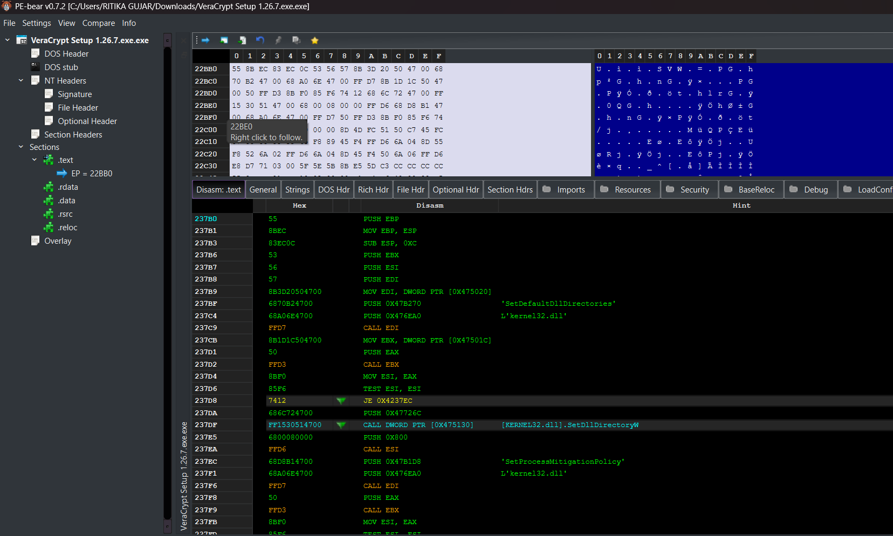
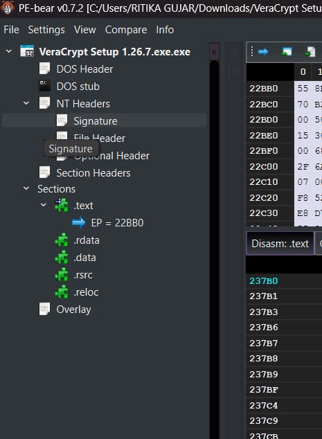

# Portable Executable Entry Point Analysis using PE-bear

A cybersecurity project demonstrating static analysis of a Windows Portable Executable (PE) file using PE-bear to identify the executable's Entry Point (EP) and examine its basic structure.

## Objective

The objective of this project is to understand the structure of Portable Executable (PE) files and locate the Entry Point (EP) using PE-bear.

## Tool Used

- PE-bear
- Windows Operating System

## Features

- Static PE file analysis
- PE Header inspection
- Section analysis
- Entry Point (EP) identification
- Basic executable structure analysis

## Steps Performed

- Opened the executable (.exe) file in PE-bear.
- Examined the PE file structure.
- Navigated through the section headers.
- Located the executable Entry Point (EP).
- Observed executable sections such as .text, .rdata, .data, .rsrc, and .reloc.

## Project Outcome

- Successfully identified the executable Entry Point.
- Understood the basic structure of Windows PE files.
- Learned how PE-bear assists in static malware analysis.
- Improved understanding of executable file analysis.

## Disclaimer

This project was performed only in a controlled environment for educational and ethical cybersecurity learning purposes.

## Project Screenshots

### PE File Structure

### Entry Point Analysis

